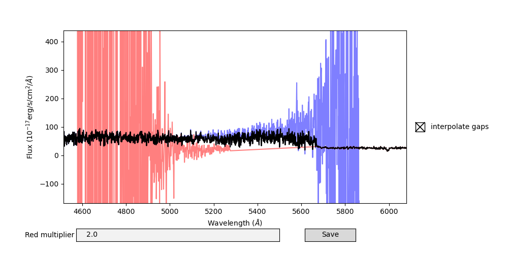

***************
Manual Splicing
***************

In the case that the association of objects/traces between the red and blue
sides of DBSP is incorrect, you can use the script ``dbsp_splice`` to manually
stitch together two coadded spectra.

You must provide the path to the raw files, so that the raw headers can be
packaged into the final data product, as well as the filename to save the
spliced spectrum to, and the red and blue coadds you wish to splice together.

.. code-block :: console

  $ dbsp_splice --help
  usage: dbsp_splice [-h] [-r RED_FILE] [-b BLUE_FILE] raw_data_path outfile

  Manually splice two coadded files together for DBSP.
  After preparing the spliced spectrum, the dbsp_adjust_splicing GUI pops up to
  allow for the splicing to be adjusted. To save the manually spliced spectrum,
  you MUST press save in the GUI.

  positional arguments:
    raw_data_path         Path to raw data from this reduction
    outfile               Destination of spliced spectrum.

  optional arguments:
    -h, --help            show this help message and exit
    -r RED_FILE, --red_file RED_FILE
                          redNNNN-redMMMM_SPATXXXX.fits file.
    -b BLUE_FILE, --blue_file BLUE_FILE
                          blueNNNN-redMMMM_SPATXXXX.fits file.

Note that although the ``red_file`` and ``blue_file`` arguments are optional,
you must supply at least one of them.

*******************************
Adjusting splicing between arms
*******************************

Typically the splicing between arms is quite good, and you only need to adjust
it when the optimal extraction FWHM vary greatly between the red and blue sides.
This can happen when an extended object is near another object on the slit.
You can check the extraction FWHM visually by looking at the Extraction QA page.

.. code-block :: console

    $ dbsp_adjust_splicing --help
    usage: dbsp_adjust_splicing [-h] fname [fname ...]

    Red/Blue splicing adjustment for P200 DBSP

    positional arguments:
      fname       Final data output from DBSP_DRP to adjust the splicing of. Can be one or multiple files.

    optional arguments:
      -h, --help  show this help message and exit

In this GUI, the blue and red spectra are plotted as well as the spliced spectrum.
After using the usual Matplotlib tools to zoom and pan to the region of interest,
you can adjust the red multiplier to multiply the red flux by a constant, and
change if flux will be interpolated across detector gaps, as well as save your
changes to the same file you opened.
After you close the GUI, you will be presented with the next spectrum to adjust
the splicing of.

The default splicing that DBSP_DRP does uses a red multiplier of 1, since the
flux calibration provided by PypeIt is excellent.

