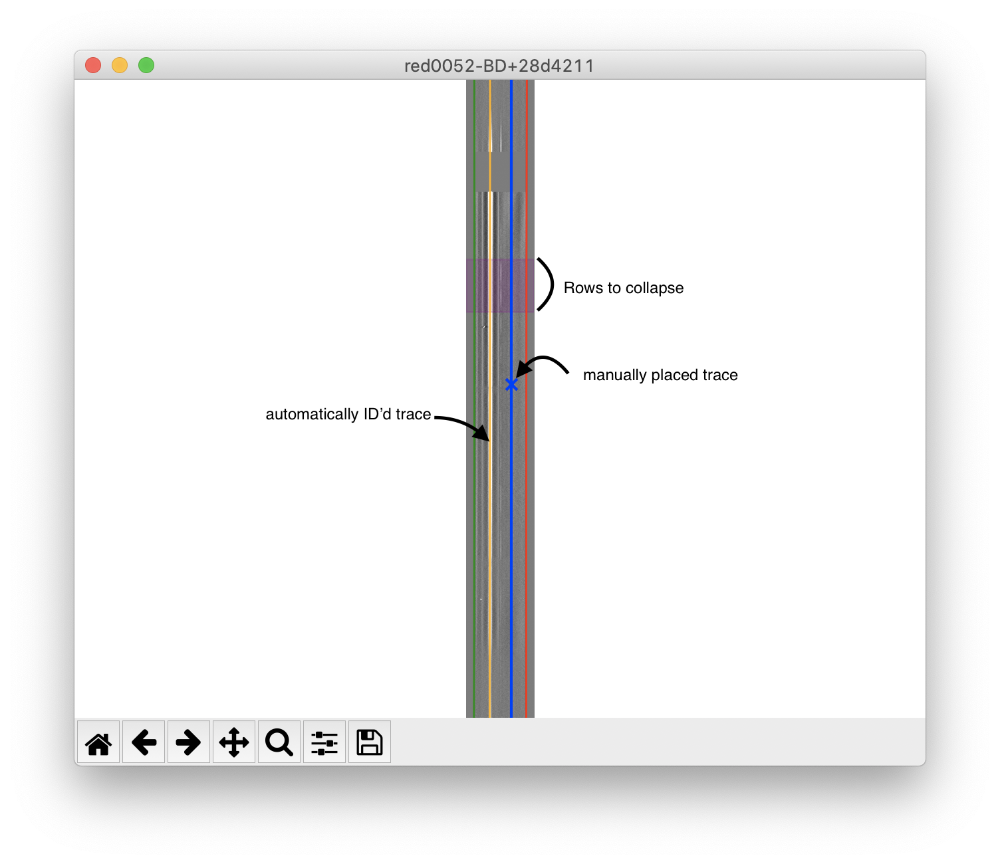
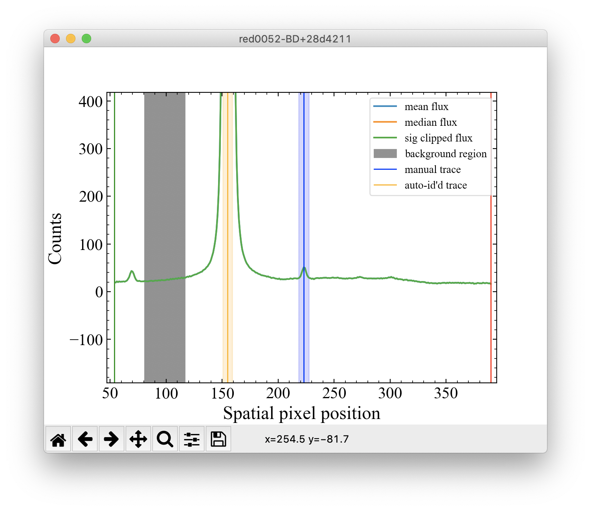

*************************************************
Using the Manual Tracing and Manual Aperture GUIs
*************************************************

Manual Tracing GUI
******************

After the first round of reducing the red and/or blue sides,
``dbsp_reduce`` will open a Matplotlib window to display the sky-subtracted spectra,
along with any object traces that were automatically detected.

Using the left and
right arrow keys, you can cycle through the spectra.

If your science target was not
automatically detected, you can zoom in on the trace using the standard matplotlib
zoom tool and then with your mouse over the trace, press the ``m`` key to mark that
trace.

If you make a mistake, you can press ``d`` with your mouse over a
previously marked trace to delete the trace.

To adjust the region of the spectrum that will be collapsed to select apertures and
background regions, press ``c``, then left click and drag to highlight the region to
be collapsed in purple.

After you close this window, for each frame you marked with a manual trace, a
window will pop up with a Manual Aperture and Sky Selection GUI.

Manual Aperture and Sky Selection GUI
*************************************
This GUI shows the collapsed flux, along with any automatically identified
traces (in orange) and your manually placed traces (in blue) along with the FWHM of
each shaded in a lighter color.

In this GUI, you can left click and drag your manual traces (in blue) to adjust
their position.

Additionally, you can right click and drag the shaded FWHM regions to adjust
their extent.

To mark background regions, press ``b`` and then left click and drag to mark
background regions by shading them in gray.

You can delete a background region by holding your mouse over the shaded background
regions and pressing ``d`` to delete.

Once you are finished adjusting manual traces/FWHMs and marking background regions,
close the window to be shown the same GUI for the next object you marked a manual
trace on.

Tips
----
Make sure to select background regions on either side of your target for the best sky subtraction.

If you are dealing with faint sources, it is a good idea to re-mark in blue any orange
(automatically identified) traces in case parameter changes lose these objects.
